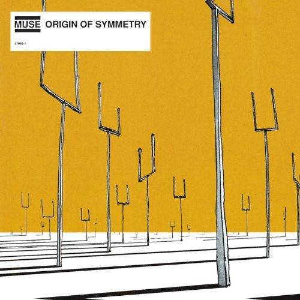
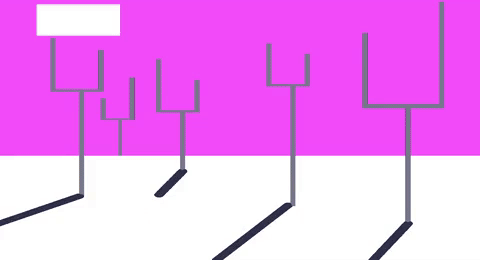
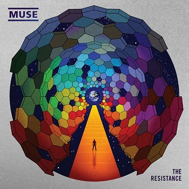
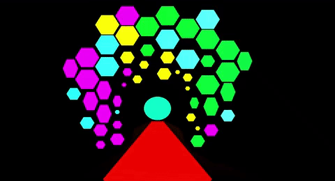

# Procedural Graphics  - Final Project

### Inspired by Simulation Theory, by Muse

https://morganherrmann.github.io/thedarkside

TO RUN DEMO SO FAR - Click the link, and load the page. Wait about 5 seconds just to make sure everything is loaded.

Press the "w" key on your keyboard. *Music woohoo*

### PROJECT STATEMENT

For this project, I aimed to create a real-time music video for an existing song, using data such as BPM to drive the motion of the shaders and scenes.

#### GOALS

1) Create a real-time set of shaders that render in time to a music video.
2) Maintain a clear art-direction, using the music video as an artistic inspiration.
3) Incorporate inspiration from the artwork of existing album covers.

#### INSPIRATION BACKGROUND

This project is heavily art-based, relying on executing the visual aesthetic of the band.  MUSE is recognized worldwide for their incredible light shows in live performances, and musical themes surrounding dystopian futures, biological warfare, and computer simulations.  Imagery seen in their music videos involves everything from microscopic visuals, to cyberpunk graphics.

Some of their album covers can be seen below.

While incorporating some of these designs to pay an homage to previous albums, their newest - "Simulation Theory", seen below-- is the primary artistic inspiration for this project.

### Music - Structural Framework
In order to handle the music portion, I implemented the following:

1) Used Howler.js, an API for playing music with typescript, installed as an NPM package.
2) Upon pressing some key, the music is triggered to call its play() method.
3) At the moment the music begins to play, a new Date is created.  The milliseconds since the start are recorded as ELAPSED TIME, and this value is used to determine which scene to render.
4) I went through the specific piece of music, and mapped out specific time intervals for each scene/shader in seconds.
5) The elapsed time is actually passed to the shaders, replacing u_Time.

CHALLENGES : Getting the music and elapsed time to line up without delay took quite some time.  Timing with javascript/typescript is especially difficult because of the asynchronous nature of the language.

### Shader Timing

The Basics : If you play through the demo, you will notice that the graphics move perfectly on the beat of the music.  I achieved this by computing various cubic, sin, cosine, etc, functions whose periods were equal to the elapsed time of a single beat.  

In this case, the music is approximately 100 BPM, so each beat is approximately 0.6 seconds.
For example, solving sin(ax +b) for a period of 0.6 seconds gives us a coefficient of a multiple of 5.23.  I applied this concept across various functions to achieve the pulsating imagery.

## DRAWING TECHNIQUES USED

### RAY MARCHING
Several scenes in this project, primarily album cover recreations, were recreated with 2D raymarching and use of toolbox functions to determine intersection and smoothing between objects.
The intended goal was to have 2D, animated renditions that channeled existing album covers. 
All shapes were drawn with ray marching and were hand placed.

{:height="700px" width="400px"}

 

